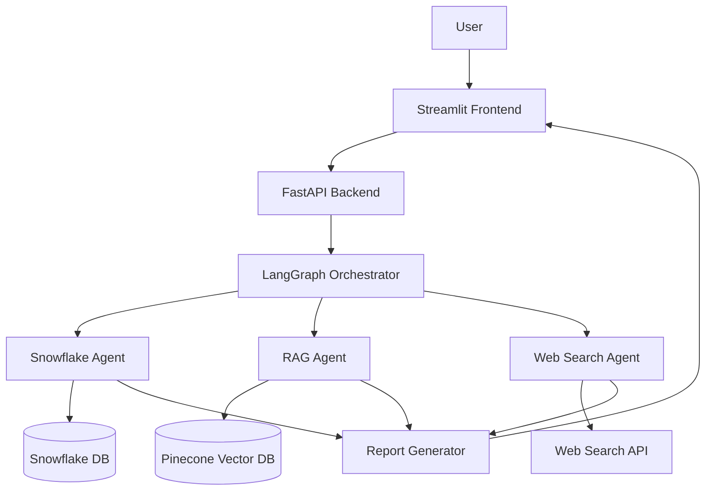

# RAG Pipeline with Multi-Agent System

An integrated research assistant leveraging three specialized agents to produce comprehensive research reports on NVIDIA.

## Project Overview

This project builds a research assistant that combines three specialized agents:

1. **Snowflake Agent**: Queries structured valuation measures from Snowflake database.
2. **RAG Agent**: Uses Pinecone for metadata-filtered retrieval from NVIDIA quarterly reports.
3. **Web Search Agent**: Fetches real-time data from the web using search APIs.

The system produces comprehensive research reports that include historical performance, financial metrics, and real-time industry insights.

## Architecture

The system consists of:

- **Frontend**: Streamlit application for user interaction
- **Backend**: FastAPI service orchestrating the multi-agent system
- **Agents**: Three specialized agents using LangGraph for orchestration
- **Databases**: Snowflake (structured data) and Pinecone (vector database)
- **Deployment**: Docker containers for easy deployment



## Features

- **Research Question Interface**: Natural language queries about NVIDIA
- **Metadata Filtering**: Filter by Year/Quarter using Pinecone metadata
- **Agent Selection**: Trigger individual or combined agent responses
- **Structured Reports**: Clear presentation of summaries, visuals, and insights
- **Real-time Data**: Latest information from web searches
- **Financial Visualization**: Charts and graphics from structured data

## Setup and Installation

### Prerequisites

- Docker and Docker Compose
- API keys for:
  - OpenAI (or alternative LLM provider)
  - Snowflake
  - Pinecone
  - Web Search API (SerpAPI, Tavily, or Bing)

### Environment Setup

1. Clone the repository:
   ```bash
   git clone https://github.com/DAMG7245/Assigmnent5A.git
   cd rag-multi-agent
   ```

2. Create a `.env` file with your API keys and configuration:
   ```
   # LLM Provider
   OPENAI_API_KEY=your_openai_api_key
   
   # Snowflake
   SNOWFLAKE_ACCOUNT=your_snowflake_account
   SNOWFLAKE_USER=your_snowflake_user
   SNOWFLAKE_PASSWORD=your_snowflake_password
   SNOWFLAKE_DATABASE=your_snowflake_database
   SNOWFLAKE_SCHEMA=your_snowflake_schema
   
   # Pinecone
   PINECONE_API_KEY=your_pinecone_api_key
   PINECONE_ENVIRONMENT=your_pinecone_environment
   PINECONE_INDEX=your_pinecone_index
   
   # Web Search API
   SEARCH_API_KEY=your_search_api_key
   SEARCH_API_PROVIDER=serpapi  # Or tavily, bing
   ```

### Running with Docker

1. Build and start the containers:
   ```bash
   docker-compose up -d
   ```

2. Access the application:
   - Frontend: http://localhost:8501
   - Backend API: http://localhost:8000

## Usage

1. Open the Streamlit application in your browser.
2. Enter a research question about NVIDIA in the text input.
3. (Optional) Select specific quarters/years to filter the results.
4. (Optional) Select which agents to activate for the query.
5. Submit your question and review the comprehensive research report.

### Example Queries

- "How has NVIDIA's revenue grown over the past 3 quarters?"
- "What are the current market trends affecting NVIDIA's stock price?"
- "Compare NVIDIA's P/E ratio to industry standards in 2023"
- "What were NVIDIA's key achievements in Q2 2023?"

## Project Structure

```
rag-multi-agent/
├── backend/
│   ├── agents/
│   │   ├── rag_agent.py
│   │   ├── snowflake_agent.py
│   │   └── websearch_agent.py
│   ├── langraph/
│   │   └── orchestrator.py
│   └── utils/
│       ├── chunking.py
│       ├── conn_snowflake.py
│       └── data_fetch.py
├── frontend/
│   └── app.py
├── docker/
│   ├── Dockerfile.backend
│   └── Dockerfile.frontend
├── requirements.txt
├── docker-compose.yml
└── README.md
```

## Development

### Adding New Data Sources

To extend the Snowflake agent with additional data:

1. Update the Snowflake database schema.
2. Modify `snowflake_agent.py` to query the new data.
3. Update the report generation logic to include the new data.

### Modifying the RAG System

To update the RAG system:

1. Update the chunking strategy in `chunking.py`.
2. Update the metadata extraction in the RAG pipeline.
3. Modify the Pinecone index schema if needed.

### Adding New Agent Types

To add a new agent:

1. Create a new agent module in the `agents/` directory.
2. Update the orchestrator to include the new agent.
3. Update the frontend to allow users to interact with the new agent.

## Troubleshooting

### Common Issues

- **Connection to Snowflake fails**: Check your Snowflake credentials and network access.
- **Pinecone queries return empty results**: Verify that your index is populated and metadata filters are correct.
- **Web search API rate limiting**: Implement retry logic or consider switching providers.

## Resources

- [Pinecone Hybrid Search with Metadata](https://docs.pinecone.io/docs/hybrid-search)
- [LangGraph Multi-Agent Example](https://langchain-ai.github.io/langgraph/getting-started/multi-agent/)
- [FastAPI Documentation](https://fastapi.tiangolo.com/)
- [Streamlit Documentation](https://docs.streamlit.io/)
- [Snowflake Documentation](https://docs.snowflake.com/)
- [SerpAPI Documentation](https://serpapi.com/docs)
- [Tavily Documentation](https://docs.tavily.com/)

## License

This project is licensed under the MIT License - see the LICENSE file for details.

## Acknowledgments

- This project was developed as part of Assignment 4.2 for MSAI program.
- Special thanks to the teaching staff for their guidance and support.
